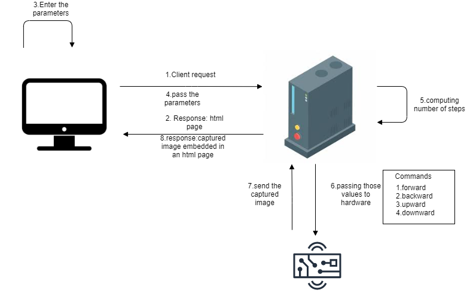
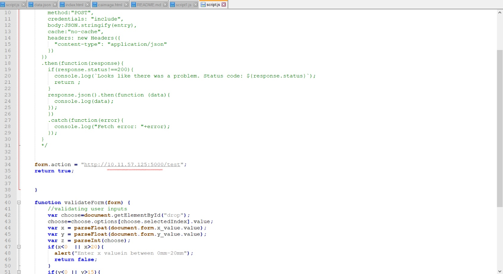
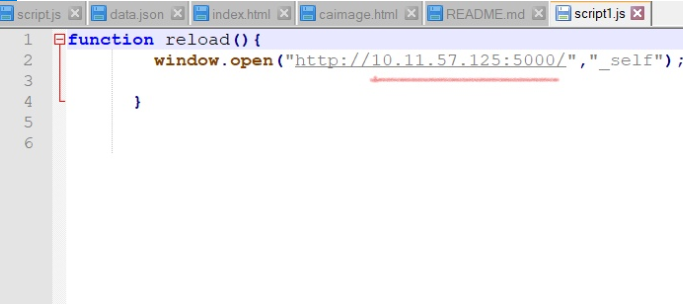
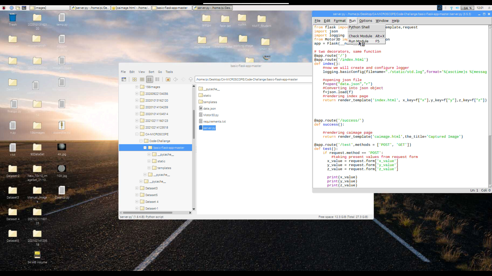
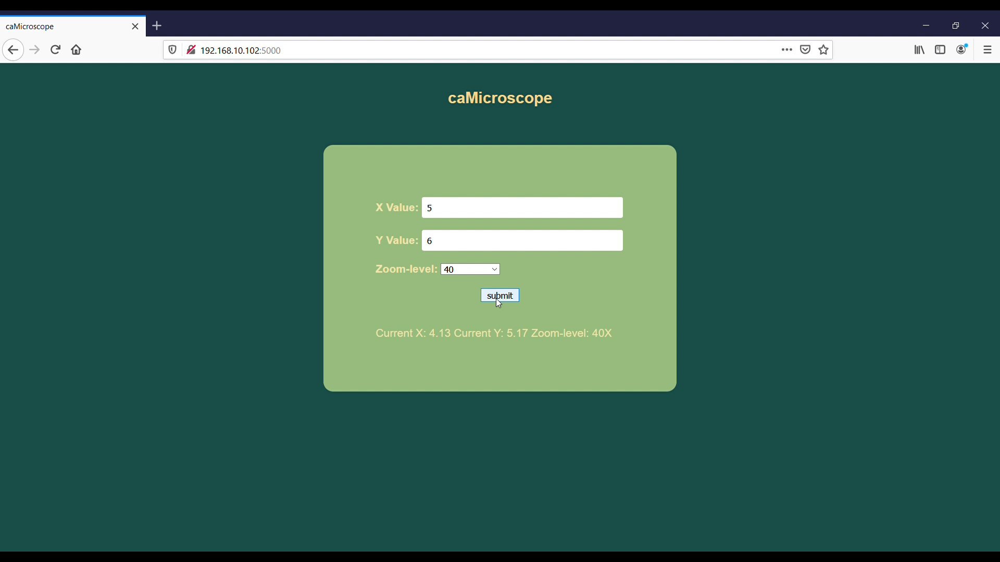
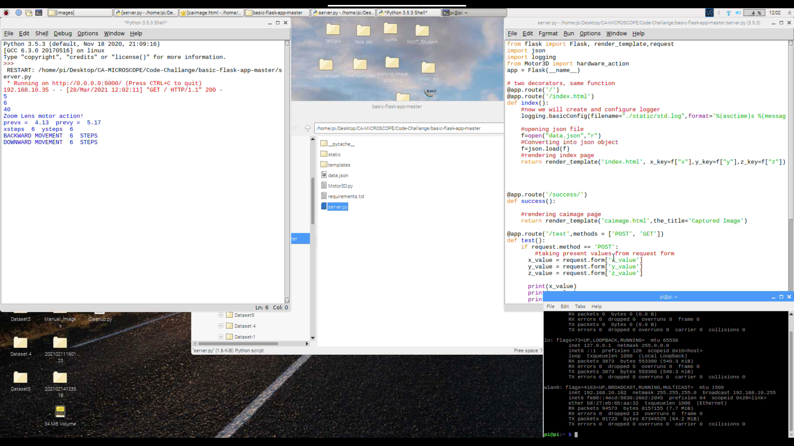
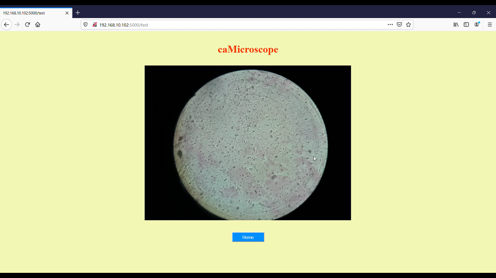
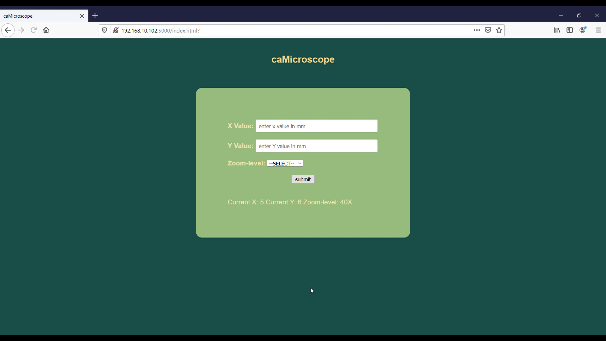

# Integrate-an-Optical-Microscope
## Requirements
Python - 3.5.3
- OpenCV - 3.4.4.19 
- Numpy - 1.18.1
- Flask - 0.12.1
- RPi.GPIO - 0.6.5

JavaScript
## Architecture

## Detailed Description/Overview:

I am creating a web service using flask framework in python and the APIs are defined in our server which runs on Raspberry Pi. Here, JavaScript from our client page will call the corresponding flask APIs to render the index page when a client accesses the webserver, validates the x position input, y position input and zoom level. When the user inputs invalid data, an alert will be displayed at the client-side. The current input values along with the previous position of the x-y stage (stored in JSON file) are supplied as parameters to calculate the relative steps required to move the motorized x-y stage. The steps are then passed as signals to the motors to move to the desired position. The camera returns an image and it is stored in Raspberry Pi. The client will be routed to the caimage html page and image is rendered in the body using JavaScript. On clicking the home button, the client will be redirected to the index page and the present position of x-y stage is updated in JSON file.
## Steps to download the repository and setup the server
- Download the github repository using the command 
```bash 
git clone https://github.com/peddivarshith/Integrate-an-Optical-Microscope.git
```
- Go to the command line terminal and find the ip address of host using the following command
 **In windows**
```bash
ipconfig
```
 **In Linux/Raspbian OS**
```bash
ifconfig
```
- Open the cloned repository folder.
- Update the same ip address in static/javascript/script.js.


**script.js**
</br></br>

- Update the same ip address in static/javascript/script1.js. 



- Run the **server.py** from repository folder 

or either run the following command in the Integrate-an-optical-microscope folder in command prompt
```bash
python3 server.py
```
## Steps to access the webservice (CLIENT)
- Then open browser(chrome/firefox/edge) and enter the server ip address along with :5000/ (ip address with port number)

Example 
```bash
192.168.10.102:5000/
```

- Enter the x value, y value and select the zoom level from the drop down list. (Default lens available are 4x,10x,40x and 100x). The previous x,y and zoom values are displayed at the bottom of the page and submit the page.

- On server side in the running console you can see the computed steps.

- The captured image of the slide will be displayed in the browser(the image is captured with refernce to previous positions).

- To go to another position, click on home button and re-enter the values(you can see at bottom that the previous values have changed to the present values).

```bash
Note: Minimum distance that the motors can move is 126 micro meters.
```
## Detailed explanation is given in the below video
[video-link](https://youtu.be/UTpugdhTstc)
